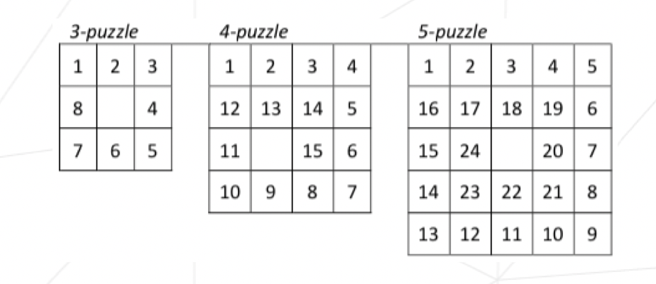

# N Puzzle

An implementation of A* algorithm to solve the N Puzzle problem. N Puzzle is a generalization of the famous [15 Puzzle problem](https://en.wikipedia.org/wiki/15_puzzle). Both Python and C++ implementations are provided.  

Please note that the puzzle is solved when a "snail" state is achieved, which is different from the classical goal state. Here are examples


You can choose one of the following admissible heuristic functions (in order of increasing efficiency)

1. Hamming 
2. Euclidian
3. Manhattan
4. Manhattan with linear conflicts

In addition, the Python implementation can accept multiple search modes:

1. A* (optimal)
2. greedy (fast when N is large)
3. uniform

---

To generate puzzles,

```sh
python3 npuzzle_gen.py --help
```

To run Python version,

```sh
python3 -m pip install -r requirements.txt
python3 solver.py --help
python3 solver.py < "your-puzzle-file"
```

To run C++ version,

```sh
make
./solver --help
./solver < "your-puzzle-file"
```
